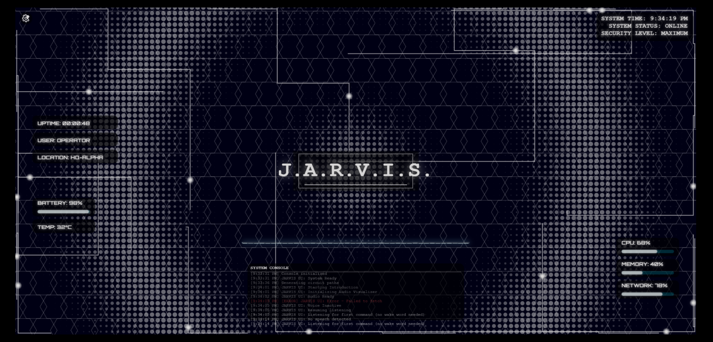

# J.A.R.V.I.S. - Just A Really Versatile but Ignorant System

<div align="center">
  
  <p><em>Your personal AI assistant awaits your command, sir.</em></p>
</div>

## 🔷 Overview

JARVIS is a cutting-edge AI assistant interface inspired by Tony Stark's AI system from the Iron Man films. This project combines stunning visual effects with advanced speech recognition and AI integration to create an immersive, interactive experience.

## ✨ Features

- **Immersive Visual Interface**:
  - Dynamic ripple animations responding to user interaction
  - Pulsating circuit lines creating a living environment
  - Hexagonal grid overlay with depth perception
  - HUD panels displaying real-time system metrics
  - Audio visualization that reacts to JARVIS's voice

- **Advanced Voice Interaction**:
  - Continuous listening with smart pause during JARVIS responses
  - Speech recognition for natural voice commands
  - Premium text-to-speech via ElevenLabs API
  - Visual feedback for all voice activity states

- **AI Integration**:
  - Gemini API integration with robust timeout handling
  - Intelligent response processing
  - Context-aware conversation capabilities
  - Seamless backend communication

- **Interactive Experience**:
  - Captivating boot sequence with staggered animations
  - Dynamic console with real-time system logging
  - Power control with elegant animations
  - Adaptive UI that responds to system states

## 🚀 Getting Started

1. Clone the repository
```bash
git clone https://github.com/yourusername/jarvis.git
cd jarvis
```

2. Configure your API keys in the `.env` file
```
ELEVENLABS_API_KEY=your_key_here
GEMINI_API_KEY=your_key_here
```

3. Launch the application
```bash
npm start
```

4. Press the power button and speak to JARVIS

## 💻 Technical Architecture

- Frontend: HTML5, CSS3, JavaScript with custom animation framework
- Voice Processing: Web Speech API with enhanced continuous listening
- AI Backend: Node.js server with Gemini API integration
- Voice Synthesis: ElevenLabs API for realistic voice generation

## 📚 Documentation

Comprehensive documentation is available covering:
- Component architecture
- State management system
- Visual feedback implementation
- Timeout handling for API calls
- Backend integration details
- Troubleshooting guides

## 🔧 Customization

JARVIS can be customized to suit your preferences:
- Voice options through the ElevenLabs voice library
- Visual theme adjustments via CSS variables
- Response behavior configuration

## 📝 License

MIT

---

<div align="center">
  <p><strong>"Sometimes you gotta run before you can walk."</strong> - Tony Stark</p>
</div> 